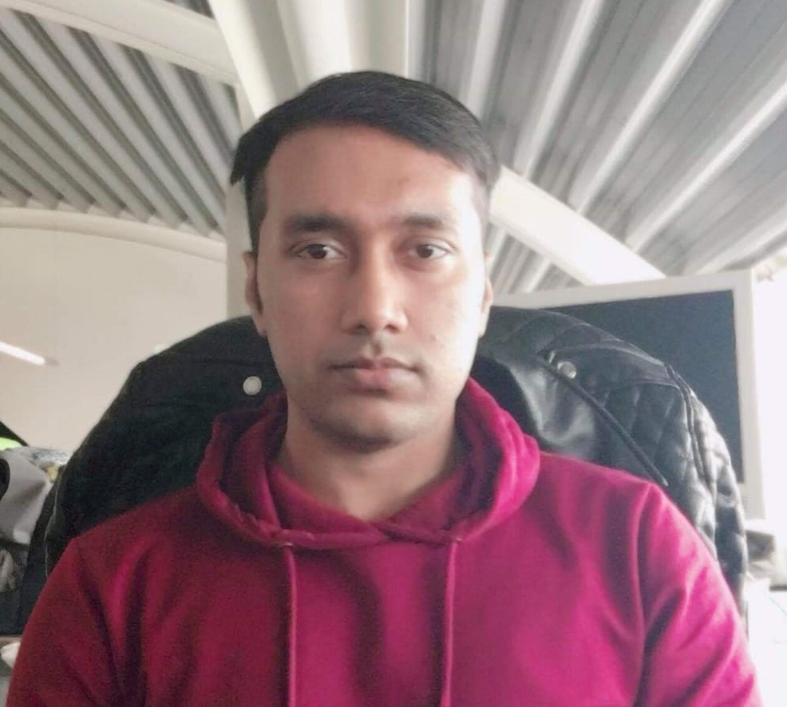

<!DOCTYPE html>
<html lang="en">
<head>
    <meta charset="UTF-8">
    <meta name="viewport" content="width=device-width, initial-scale=1.0">
    <title>Soyed Tuhin Ahmed - Research Profile</title>
    <link rel="stylesheet" href="https://maxcdn.bootstrapcdn.com/bootstrap/4.5.2/css/bootstrap.min.css">
    
    
    
    
</head>
<body>

<nav class="navbar navbar-expand-sm bg-dark navbar-dark">
  <a class="navbar-brand" href="#">Soyed Tuhin Ahmed</a>
  <button class="navbar-toggler" type="button" data-toggle="collapse" data-target="#collapsibleNavbar">
    
  </button>
  

    <ul class="navbar-nav">
      <li class="nav-item">
        <a class="nav-link" href="#about">About</a>
      </li>
      <li class="nav-item">
        <a class="nav-link" href="#awards">Awards</a>
      </li>
      <li class="nav-item">
        <a class="nav-link" href="#projects">Projects</a>
      </li>
      <li class="nav-item">
        <a class="nav-link" href="#research">Research</a>
      </li>
      <li class="nav-item">
        <a class="nav-link" href="#publications">Publications</a>
      </li>
      <li class="nav-item">
        <a class="nav-link" href="#contact">Contact</a>
      </li>
    </ul>
  
  
</nav>

    

        

            
        

        

            <h2 id="about">About Me</h2>
            
I am a PhD student in computer science at KIT - Karlsruhe Institute of Technology, Karlsruhe, Germany at the Chair of Dependable Nano Computing (CDNC), working under the supervision of Prof. Dr. Mehdi B. Tahoori. My research interests include neuromorphic computing, resilient hardware accelerator for machine learning, robust and accurate deep learning, hardware architectures for neural network applications, computation in memory, and emerging memory computing paradigms.

        

    

    

        <h2>Awards and Nomination</h2>
        <ol>
            <li><strong>Richard Newton Fellowship</strong> at DAC 2022</li>
            <li><strong>Summa-Cum-Laude</strong> and <strong>university gold medal</strong> from Amarican International University Bangladesh (AIUB), 2016</li>
            <li><strong>Academic Merit Scholarship</strong> from Amarican International University Bangladesh (AIUB), 2013-2015</li>
            <li><strong>EIT Digital Scholarships</strong>, entry at KTH Royal Institute of Technology, Sweden, 2016 (did not pursue)</li>
            <li><strong>Marie Curie Fellowship</strong> from University of York, UK, 2022, (did not pursue)</li>
            <li>Several <strong>best paper nominations</strong>, see below</li>
        </ol>
    

    

        <h2>Research Projects</h2>
        <ul>
            <li><strong>NeuSPIN – An ANR project</strong>: NeuSPIN stands for Design of a reliable edge neuromorphic system based on spintronics for Green AI <a href="https://www.spintec.fr/neuspin-an-anr-project/">[Link]</a></li>
        </ul>
    

    

        <h2>Neuromorphic Computing and Deep Learning Research Overview</h2>
        <h3>Research Statement</h3>
        
My research is in the field of robust and efficient algorithms for neuromorphic computing with emerging resistive NVM memories (e.g., spintronics), fault tolerance, testing, and uncertainty estimation. The primary aim is to develop efficient and robust neuromorphic systems, addressing challenges to a trustworthy deep learning system with uncertainty estimation, fault tolerance, and testability with an algorithm-hardware co-design approach. For a detailed research statement, please refer to <a href="ResearchStatement.md">ResearchStatement</a>.

    

    

        <h2>Publications</h2>
        <h3>Journals</h3>
        <ol>
            <!-- List of journal publications -->
        </ol>
        <h3>Conferences</h3>
        <ol>
            <!-- List of conference publications -->
        </ol>
    

    

        <h2>Contact</h2>
        
<strong>Email</strong>: soyed.ahmed@kit.edu

    

</body>
</html>
